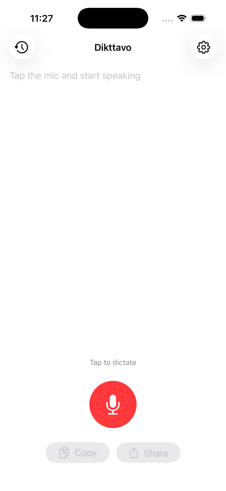

# Dikttavo


[](https://github.com/vishwas46/dikttavo/actions/workflows/ci.yml)


A private, fully on-device voice-to-text app for iPhone, iPad and Mac. Tap to
record, speak, watch the live transcription, and get a tidied-up version the
moment you stop — all without a single byte leaving the device.

Every dictation app *says* it's private. Dikttavo is ~1,300 lines of Swift you
can read in an afternoon: **there is no networking code in this app** — no
URLSession, no sockets, no SDKs, no analytics. It works with airplane mode on.
That claim is auditable, this repo is the audit, and a CI check fails any
change that would break it.

<p align="center">
  
</p>

- **Transcription:** Apple `SpeechAnalyzer` + `SpeechTranscriber` with the
  iOS/macOS 27 speech models, and automatic fallback to `DictationTranscriber`
  for locales or devices the new transcriber doesn't cover.
- **Cleanup:** Apple Foundation Models (the on-device `SystemLanguageModel`)
  removes filler words, fixes punctuation/capitalization, and formats
  sentences — on devices with Apple Intelligence. Long dictations are cleaned
  in parts so they fit the model. When cleanup can't run, the app says why
  (Apple Intelligence off, model still downloading, unsupported device) and
  keeps the raw transcript.
- **History:** SwiftData store in the app sandbox. Per-item delete, Clear All,
  and a privacy toggle that stops saving entirely.
- **iPhone, iPad and Mac:** one SwiftUI target. iPad and Mac get a history
  sidebar next to the dictation pane; on the Mac it's a native app with a
  Dictation menu (⌘R to start/stop) and a standard Settings window.
- **Zero dependencies:** no network code, no analytics, no accounts, no
  third-party SDKs.

## Privacy invariants

1. Everything runs on-device; the app contains no networking code. The only
   network activity ever triggered is the OS itself downloading a speech model
   the first time a language is used (and Apple Intelligence models, managed by
   the OS). After that, dictation and cleanup work in airplane mode.
2. The microphone is live **only** between tapping record and tapping stop.
   Capture stops — and on iPhone/iPad the `AVAudioSession` is deactivated with
   `setActive(false)` — the instant recording stops; see `Recorder.swift`. There
   is no background listening and no warm session between dictations; leaving
   the app stops dictation (`handleScenePhaseChange`).
3. The system shows its microphone indicator (the orange dot on iPhone/iPad,
   the menu-bar indicator on Mac) while recording. That's expected — it should
   appear when you start and vanish within ~1 second of stopping.
4. Cleanup uses only the on-device model. iOS/macOS 27 added a Private Cloud
   Compute model to the same framework; Dikttavo never uses it.
5. On the Mac, the App Sandbox grants microphone access and nothing else —
   there is no network entitlement, so macOS itself would block a connection.
6. Enforced, not just promised: [`scripts/check-privacy.sh`](scripts/check-privacy.sh)
   runs in CI on every push and pull request and fails on networking APIs, the
   cloud model, third-party packages, or a Mac network entitlement. The App
   Store privacy manifest (`PrivacyInfo.xcprivacy`) declares no tracking and no
   collected data.

## Requirements

- Xcode 27; iOS 27, iPadOS 27 or macOS 27 (Mac with Apple silicon).
- Live dictation needs a real iPhone, iPad or Mac — the iOS Simulator doesn't
  support the speech engines (the app detects this and says so instead of
  hanging).
- AI cleanup needs an Apple-Intelligence-capable device with Apple Intelligence
  turned on. Otherwise the app shows a short note and keeps transcripts raw.

## Run it

### iPhone or iPad

1. Open `Dikttavo.xcodeproj` in Xcode.
2. Pick the `Dikttavo` scheme and an iPhone or iPad destination (simulator for
   UI-only, a connected device for real dictation).
3. For a device: select the project → target **Dikttavo** → *Signing &
   Capabilities* → choose your **Team** (add your Apple ID under Xcode ▸
   Settings ▸ Accounts if the menu is empty). Change the bundle identifier if
   it collides.
4. Press ⌘R. First run on device: enable Developer Mode when iOS asks
   (Settings ▸ Privacy & Security ▸ Developer Mode), and trust the developer
   certificate (Settings ▸ General ▸ VPN & Device Management).
5. Tap the red mic button, grant microphone + speech recognition, and speak.

### Mac

Choose the **My Mac** destination and press ⌘R (set your Team as in step 3).
Click the mic or press ⌘R in the app, grant microphone + speech recognition,
and speak.

First use of a language downloads its speech model once (progress bar in the
app). Everything afterwards — including airplane mode — is fully offline.

## Project layout

```
Dikttavo/
├── DikttavoApp.swift      app entry: one shared engine, SwiftData container, scenes, ⌘R menu
├── RootView.swift         iPhone stack vs. iPad/Mac sidebar layout
├── DictationView.swift    dictation pane: record button, live transcript, raw/cleaned toggle
├── DictationEngine.swift  state machine: permissions → record → transcribe → clean → save
├── Recorder.swift         AVAudioEngine capture; microphone lifecycle (the mic invariant)
├── Transcriber.swift      SpeechAnalyzer + SpeechTranscriber/DictationTranscriber + assets
├── Cleaner.swift          Foundation Models transcript cleanup (tidy only, never answer)
├── Platform.swift         the few iOS/macOS differences (clipboard, settings link, wording)
├── DictationRecord.swift  SwiftData model (raw + cleaned)
├── HistoryView.swift      local history list + detail, delete / clear all
├── SettingsView.swift     language, auto-cleanup, save-history toggles
└── PrivacyInfo.xcprivacy  privacy manifest: no tracking, no data collected
scripts/check-privacy.sh   the privacy invariants as a script (runs in CI)
```

## Debug helpers

- `scripts/check-privacy.sh` — run the privacy checks locally before a PR.
- `simctl launch <udid> com.vishwas.Dikttavo -seedHistory` seeds two sample
  history records (DEBUG builds only) so history UI can be exercised in the
  simulator, where dictation itself can't run.
- Diagnostic logging: subsystem `com.vishwas.Dikttavo`, category `dictation`
  (`log stream --predicate 'subsystem == "com.vishwas.Dikttavo"' --level info`).

## Contributing

Issues and PRs are welcome — especially dictation-quality reports for non-English
locales and testing on different Apple Intelligence hardware. One rule is
non-negotiable: **no networking code, no third-party dependencies.** PRs that
add either will be declined regardless of the feature (CI will flag them
anyway); the entire point of this app is that its privacy claims are enforced
by absence.

## License

[MIT](LICENSE) — do whatever you like, attribution appreciated.
